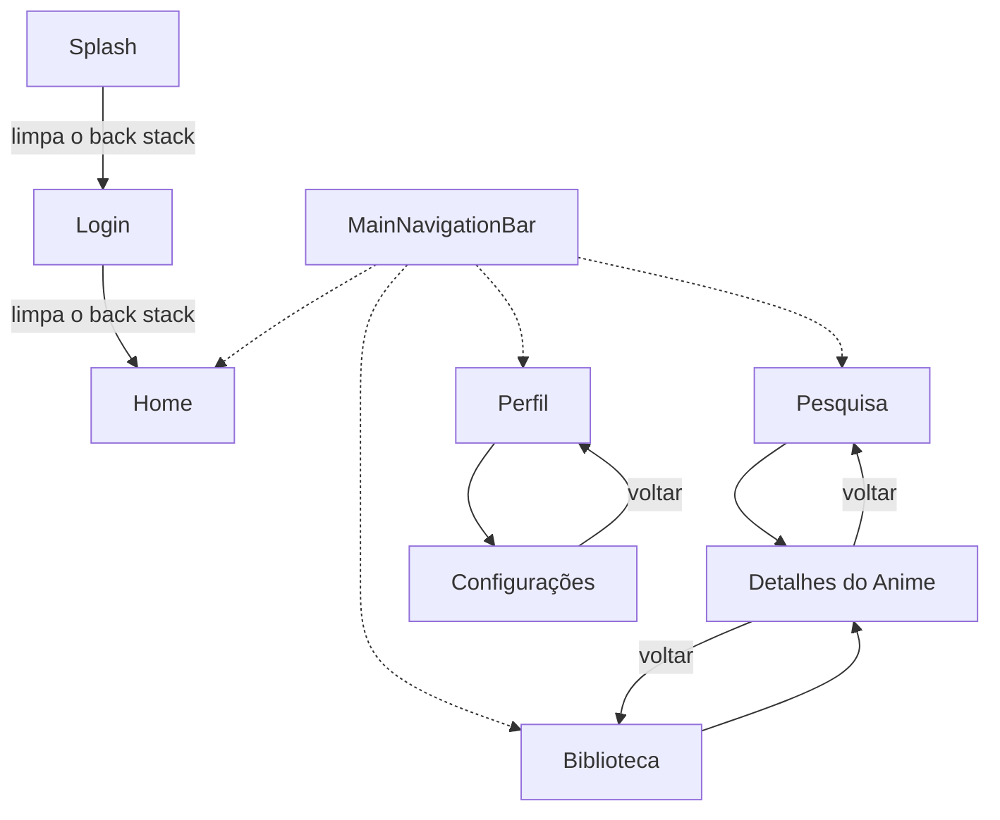
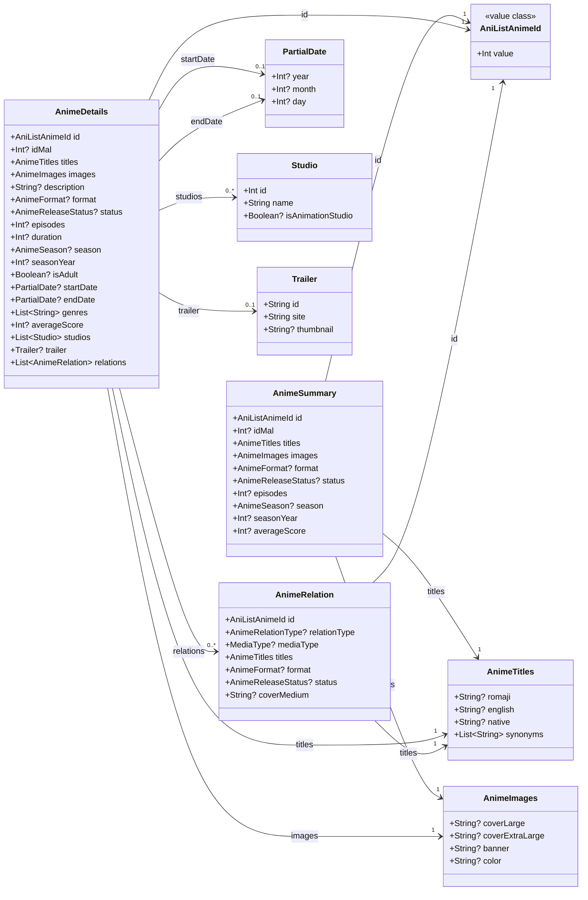
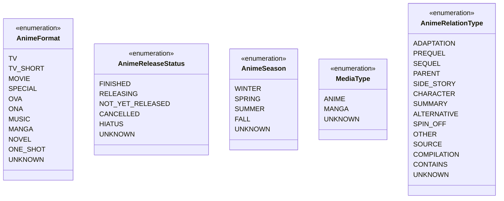
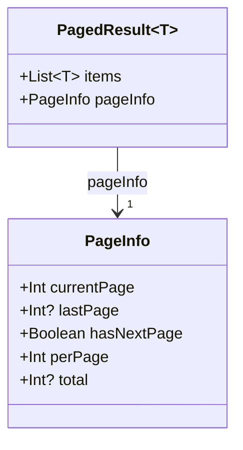
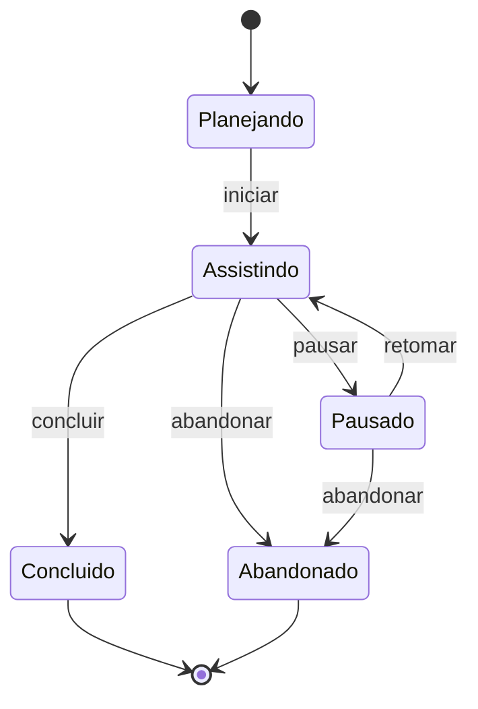
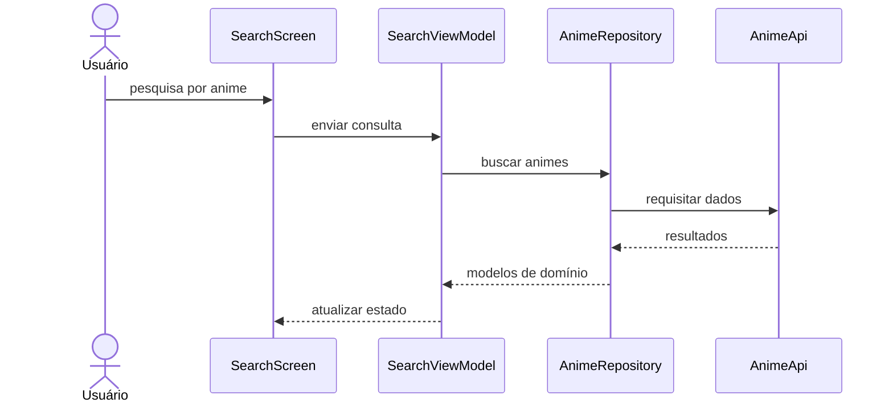
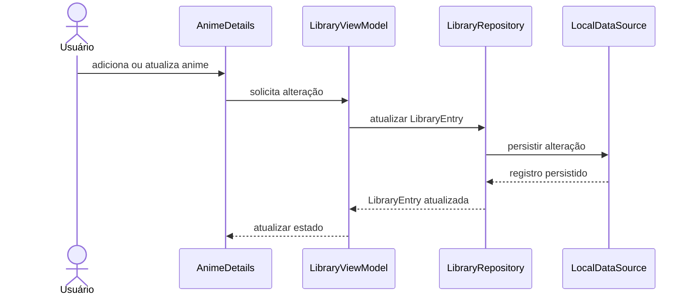
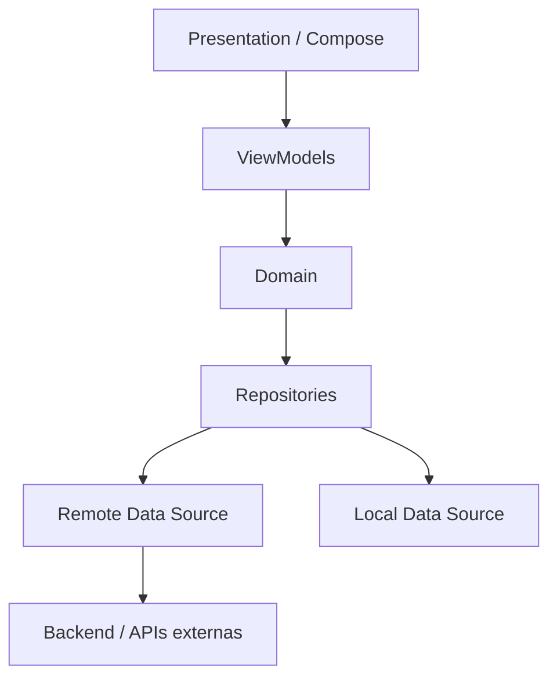

# MykytaDu — Modelagem

> Arquitetura, modelos e fluxos vigentes ou explicitamente propostos.
>
> Este arquivo concentra os diagramas do sistema utilizando **Mermaid**, acompanhados de explicações sobre decisões de domínio, navegação, arquitetura e fluxos.
>
> Histórico de execução e evidências pertencem aos registros em `docs/sprints/`.

---

# 1. Objetivo

Este documento registra visualmente a estrutura do **MykytaDu**, um aplicativo multiplataforma para controle e acompanhamento de animes.

Os diagramas aqui presentes devem servir como apoio para:

- compreender a estrutura do sistema;
- discutir decisões antes da implementação;
- registrar relações entre entidades;
- documentar fluxos importantes;
- visualizar estados e transições;
- manter alinhamento entre UI, domínio, dados e navegação;
- distinguir arquitetura implementada de propostas ainda não comprovadas.

A modelagem acompanha o código vigente. Mudanças históricas pertencem ao registro
da sprint e decisões arquiteturais duráveis apontam para ADRs.

---

# 2. Princípios de Modelagem

A documentação do MykytaDu segue os mesmos princípios gerais adotados no desenvolvimento:

- Evolução incremental;
- Evitar antecipação de funcionalidades futuras;
- Uma responsabilidade clara por elemento;
- Baixo acoplamento;
- Reutilização;
- Regras de negócio fora da UI;
- Comunicação externa abstraída por repositories;
- Modelos imutáveis sempre que possível;
- Código e implementação real têm prioridade sobre documentação desatualizada.

Quando houver divergência entre modelagem e implementação, a ordem de prioridade é:

```text
Código atual
    ↓
Builds e testes executados
    ↓
Implementações e validações recentes
    ↓
Documento Mestre
    ↓
Modelagem
    ↓
Roadmap
    ↓
Documentos históricos
```

Após uma decisão arquitetural relevante ser consolidada no código, este documento deve ser atualizado.

---

# 3. Convenções dos Diagramas

Os diagramas deste documento utilizam **Mermaid**.

## 3.1 Tipos previstos

Conforme a necessidade da representação, podem ser utilizados:

- `flowchart` — navegação e fluxos;
- `classDiagram` — modelos e relações de domínio;
- `stateDiagram-v2` — estados e transições;
- `sequenceDiagram` — interação entre camadas;
- `erDiagram` — persistência e estrutura de dados, quando necessário.

Diagramas arquiteturais de alto nível podem utilizar `flowchart` quando a representação for mais clara do que uma notação UML tradicional.

## 3.2 Diretrizes

Cada diagrama deve:

1. Ter um objetivo claro;
2. Representar apenas elementos relevantes naquele momento;
3. Possuir uma explicação textual;
4. Diferenciar decisões consolidadas de propostas;
5. Ser atualizado quando a implementação alterar o fluxo representado.

---

# 4. Navegação compartilhada

> **Estado:** Implementado.

## 4.1 Contrato atual

A navegação compartilhada define as seguintes rotas:

As rotas implementadas são:

- Splash;
- Login;
- Home;
- Pesquisa;
- Detalhes do Anime;
- Biblioteca;
- Perfil;
- Configurações.

Também fazem parte do contrato:

- preparação de rotas protegidas;
- estrutura para Deep Links.

A navegação principal da experiência é formada por:

- Home;
- Biblioteca;
- Pesquisa;
- Perfil.

`Splash`, `Login`, `Detalhes do Anime` e `Configurações` são tratados como destinos auxiliares ou externos à navegação principal.

---

## 4.2 Diagrama de Navegação



---

## 4.3 Interpretação

O fluxo começa pela tela `Splash` e segue para `Login`. Após o avanço, cada uma dessas rotas é removida do back stack:

```text
Splash
  ↓
Login
  ↓
Home
```

Após o acionamento do placeholder de Login, o usuário entra na área principal do aplicativo.

No estado atual, o avanço é apenas um gatilho de navegação do placeholder. Não existe autenticação, validação de sessão ou regra de negócio. A infraestrutura apenas classifica as rotas para preparar a autenticação, atualmente planejada para a Sprint 12.

---

## 4.4 Área Principal

A navegação principal pode ser entendida conceitualmente como:

```text
Área autenticada
├── Home
├── Pesquisa
├── Biblioteca
└── Perfil
```

Esses quatro destinos representam as áreas de uso recorrente do aplicativo.

Eles são centralizados em `MainDestination` e apresentados por `MainNavigationBar`. A troca entre eles substitui a aba atual, evitando acumular todas as abas visitadas no back stack. A barra não é exibida em `Splash`, `Login`, `AnimeDetails` ou `Settings`.

O fluxo conceitual completo fica:

```text
Navegação raiz
├── Splash
├── Login
└── Área autenticada
    ├── Home
    ├── Pesquisa
    │   └── Detalhes do Anime
    ├── Biblioteca
    │   └── Detalhes do Anime
    └── Perfil
        └── Configurações
```

---

## 4.5 Detalhes do Anime

`Detalhes do Anime` é uma rota secundária que pode ser acessada a partir de diferentes pontos da aplicação.

Inicialmente:

```text
Pesquisa
   ↓
Detalhes do Anime
```

e:

```text
Biblioteca
    ↓
Detalhes do Anime
```

No futuro, outras áreas, como a Home, também poderão abrir diretamente os detalhes de um anime.

Essa expansão somente deve ser adicionada ao diagrama quando fizer parte da implementação real.

---

## 4.6 Configurações

A rota `Configurações` está relacionada ao contexto do usuário e é acessada inicialmente através de:

```text
Perfil
  ↓
Configurações
```

Essa organização evita transformar a navegação principal em uma lista excessiva de destinos.

---

## 4.7 Rotas públicas e protegidas

`RouteAccess` consolida a seguinte classificação:

```text
PUBLIC
├── Splash
└── Login

PROTECTED
├── Home
├── Search
├── AnimeDetails
├── Library
├── Profile
└── Settings
```

Essa classificação é somente declarativa. A validação de sessão será implementada na Sprint 12.

---

## 4.8 Deep Links

`AppDeepLink` fornece uma resolução compartilhada para:

```text
mykytadu://app/home
mykytadu://app/search
mykytadu://app/library
mykytadu://app/profile
mykytadu://app/settings
```

Trailing slash é aceito e endereços desconhecidos retornam `null`. `AnimeDetails` não possui Deep Link porque ainda não existe um identificador definitivo de anime. Integrações de entrada específicas para Android e iOS ainda não foram implementadas.

---

# 5. Domínio do Catálogo

> **Estado:** Implementado.

O domínio contém somente os conceitos exigidos pelos casos de uso de pesquisa e detalhes. Ele permanece separado dos DTOs da AniList, com conversões explícitas para campos opcionais, coleções vazias e enums externos desconhecidos.

O escopo implementado inclui:

- resultados de pesquisa;
- detalhes de anime;
- títulos alternativos;
- imagens;
- gêneros;
- estúdios;
- datas parciais;
- trailer;
- relações entre obras;
- paginação;
- enums do domínio;
- `AnimeRepository`.

Não fazem parte desta modelagem inicial `Character`, `User`, `LibraryEntry`, `Review` ou regras detalhadas de temporadas e episódios sem consumidor atual. Esses conceitos deverão surgir somente nas sprints em que forem necessários.

## 5.1 Fronteiras do catálogo

As fronteiras vigentes são:

- separar `AnimeSummary` de `AnimeDetails`;
- preservar títulos e campos opcionais sem escolher idioma no mapper;
- manter gêneros como `List<String>`;
- converter enums remotos no mapper, com fallback seguro para valores desconhecidos;
- distinguir semanticamente IDs AniList e MyAnimeList, sem confundi-los com IDs locais ou de backend;
- manter `NetworkResult` na camada remota e expor pelo repository um resultado independente de transporte;
- adiar campos e modelos sem consumidor comprovado.

## 5.2 Contratos fundamentais

`AniListAnimeId` é um identificador positivo e semanticamente específico. `RepositoryResult` e sete categorias de `RepositoryFailure` permanecem independentes da infraestrutura. `NetworkFailure` é convertido internamente na camada de dados, com preservação opcional da causa técnica.

`PageInfo` valida página atual, tamanho da página, última página e total. `PagedResult<T>` aceita páginas vazias, preserva `hasNextPage` sem inferência pelo número de itens e mantém um snapshot da lista recebida. Esses tipos não são serializáveis e o domínio não depende de rede, GraphQL, Ktor ou DTOs.

---

## 5.3 Modelos do catálogo

`AnimeSummary` e `AnimeDetails` são independentes, sem herança nem composição entre eles. Ambos declaram seus próprios campos e reutilizam `AniListAnimeId`, `idMal: Int?`, `AnimeTitles` e `AnimeImages`.

- `AnimeTitles` preserva romaji, inglês, nativo e um snapshot dos sinônimos, sem selecionar o título exibido.
- `AnimeImages` mantém capa large, extraLarge, banner e cor opcionais.
- `PartialDate` aceita componentes independentes e valida apenas mês entre 1–12 e dia entre 1–31, sem conversão para data completa ou restrição de ano.
- `AnimeDetails` acrescenta descrição original, duração, indicação de conteúdo adulto, datas, gêneros como `List<String>`, estúdios, trailer e relações. Gêneros, estúdios e relações mantêm snapshots das listas recebidas e aceitam vazio.
- `Studio` contém ID, nome e indicação opcional de estúdio de animação. `Trailer` contém identificador, site e thumbnail opcional; a validação de strings pertence ao mapper.
- `AnimeRelation` mantém ID AniList, tipo da relação, tipo da mídia, títulos, formato, status e capa medium. Não referencia objetos completos e pode representar obras de mangá, reutilizando o identificador existente.
- `AnimeFormat`, `AnimeReleaseStatus`, `AnimeSeason`, `MediaType` e `AnimeRelationType` possuem `UNKNOWN`. As propriedades de enum são anuláveis, distinguindo ausência de valor desconhecido.

Os contratos não possuem serialização, dependências de infraestrutura ou regras de apresentação. A seleção de título na apresentação segue inglês, romaji, nativo, primeiro sinônimo e recurso localizado de título indisponível. Conversões remotas descartam trailers incompletos e relações sem nó ou ID válido individualmente.

## 5.4 Diagrama de Classes

Os diagramas representam os contratos implementados em `domain/model`. `?` indica propriedade opcional e `0..*` indica coleção que aceita vazio. As associações mostram referências entre contratos, sem implicar propriedade exclusiva ou ciclo de vida compartilhado.

### Catálogo e modelos auxiliares

`AnimeSummary` e `AnimeDetails` declaram seus campos independentemente. `AnimeRelation` identifica a obra relacionada por ID, sem referenciar um resumo ou detalhes completos.



### Enums do catálogo

`AnimeFormat` e `AnimeReleaseStatus` são utilizados por pesquisa, detalhes e relações; `AnimeSeason`, por pesquisa e detalhes. `MediaType` e `AnimeRelationType` são utilizados pelas relações. Todos possuem `UNKNOWN`, sem conversão de valores remotos nos próprios enums.



### Paginação

`PagedResult<out T>` é genérico e pode representar páginas de `AnimeSummary`, sem depender desse tipo. A lista de itens mantém um snapshot e `hasNextPage` não é inferido pela quantidade de itens.



---

## 5.5 Mapeadores AniList → domínio

Mapeadores internos em `data.mapper` convertem os contratos remotos reais para títulos, imagens, datas parciais, estúdios, trailers, enums, pesquisa, paginação, detalhes e relações resumidas.

Os mapeadores preservam nulabilidade e coleções vazias, mantêm valores desconhecidos como `UNKNOWN` e não expõem DTOs, GraphQL, Ktor ou tipos de rede ao domínio. Relações sem nó ou ID válido são descartadas individualmente, sem criar um grafo recursivo.

## 5.6 AnimeRepository

`AnimeRepository` pertence ao domínio e oferece pesquisa paginada e consulta de detalhes por `AniListAnimeId`. `AniListAnimeRepository` permanece na camada de dados, depende de `AnimeApi` e dos mapeadores e converte falhas remotas para `RepositoryFailure`.

A pesquisa normaliza a consulta com `trim` e rejeita consulta vazia, página ou tamanho inválidos. Falhas de mapeamento por `IllegalArgumentException` resultam em `InvalidData`; cancelamentos e exceções inesperadas não são interceptados. `RepositoryModule` registra uma instância singleton de `AnimeRepository` e reutiliza `AnimeApi` pelo Koin.

## 5.7 Consumidores planejados

Pesquisa e detalhes integrarão esses contratos por meio de estados, ViewModels e UI quando as respectivas funcionalidades forem implementadas.

# 6. Plataforma Web

> **Estado:** Implementado.

O suporte Web permanece no módulo `:composeApp`, sem duplicar domínio,
repositories, UI ou Navigation 3.

```text
commonMain
├── Android
├── Desktop
├── iOS
└── webMain
    ├── jsMain
    └── wasmJsMain

commonTest
└── webTest
```

WasmJS é o target principal e JavaScript é a alternativa de compatibilidade.
`webMain` e `webTest` compartilham o código aplicável aos dois targets; não
existe motivo comprovado para modularização adicional.

O entrypoint Web inicializa Koin uma vez antes de `ComposeViewport`. A engine
Ktor `Js`, baseada em Fetch, atende JS e WasmJS; logging HTTP permanece
desabilitado. CIO é usado somente no Desktop.

Navigation 3 permanece em `commonMain`. Um codec em `webMain` converte
`AppRoute` em fragmentos, enquanto adapters de `jsMain` e `wasmJsMain`
acessam History API, `location` e eventos do navegador. A integração cobre
canonicalização, reload, deep links, Back e Forward sem criar um segundo sistema
de navegação.

O shell compartilhado usa `NavigationBar` abaixo de `600.dp` e
`NavigationRail` a partir desse limite. O conteúdo expandido é centralizado e
limitado a `1200.dp`; cada tela continua responsável pelo próprio scroll.
`App()` aplica `AppTheme` e uma `Surface` raiz para que todos os entrypoints e
modos técnicos usem os mesmos tokens visuais.

Os parâmetros `network-smoke=true` e `design-system-showcase=true` selecionam
modos técnicos no entrypoint, fora das rotas de produto. O diagnóstico de rede
tem precedência. Esses modos não compõem funcionalidades do usuário.

As distribuições JS e WasmJS são independentes e servidas por HTTP estático.
Fragment routing não exige fallback de paths para SPA. PWA, service worker,
offline, deploy e hospedagem definitiva permanecem fora da arquitetura atual.

---

# 7. Biblioteca local

> **Estado:** Proposto.

`LibraryEntry` será modelado quando a persistência local for implementada. Ele representa conceitualmente a relação local com um anime dentro da biblioteca pessoal e não depende da existência de usuário autenticado ou backend.

A biblioteca seguirá a estratégia local-first:

- funciona sem autenticação;
- persiste alterações localmente;
- continua disponível sem conexão ou backend;
- habilita sincronização somente após autenticação futura;
- mantém IDs locais, IDs AniList e futuros IDs de backend separados.

Estados previstos:

- Planejando;
- Assistindo;
- Pausado;
- Concluído;
- Abandonado.

---

## 7.1 Diagrama de Estados de LibraryEntry



> As transições acima representam uma proposta inicial. Regras como reabrir um anime concluído, retomar um abandonado ou concluir automaticamente pelo número de episódios deverão ser decididas durante a Sprint 8 e validadas no fluxo da Sprint 9.

---

# 8. Fatias Verticais e Fluxos entre Camadas

> **Estado:** Proposto.

Repositories, fontes de dados, ViewModels e estados serão criados por funcionalidade, quando necessários para entregar um resultado observável. Não serão preparados antecipadamente para todas as telas.

Arquitetura conceitual esperada:

```text
UI
 ↓
ViewModel
 ↓
Repository
 ├── Remote Data Source
 └── Local Data Source
```

A UI não deverá acessar APIs diretamente.

---

## 8.1 Pesquisa de Anime



> **Estado: Proposto — ainda não implementado.** O fluxo continuará específico da busca, sem antecipar uma arquitetura assíncrona genérica. A consulta ativa deverá ser invalidada e cancelada assim que a consulta normalizada mudar; o debounce atrasará somente a nova requisição. Paginação usará `PageInfo.hasNextPage`, bloqueará concorrência e preservará os resultados diante de loading ou falha incremental.

Lifecycle, integração Koin para ViewModel e carregamento de imagens com Coil permanecem propostas sujeitas à comprovação de compatibilidade nos targets atuais. O comportamento de cache, inclusive HTTP, só poderá ser documentado após evidência por plataforma.

A Sprint 6 transportará e restaurará o `AniListAnimeId` na rota de detalhes. A Sprint 7 consumirá o ID recebido para carregar e apresentar `AnimeDetails`. O retorno dos detalhes deverá validar separadamente a preservação do ViewModel da busca, dos resultados e da posição de scroll.

---

## 8.2 Atualização da Biblioteca



> Diagrama conceitual das Sprints 8 e 9. A operação principal é local e independe do backend. A sincronização será modelada separadamente na Sprint 13, quando existirem autenticação e contratos reais.

---

# 9. Arquitetura de Alto Nível

> **Status:** Conceitual.

A estrutura atual do projeto é organizada em torno de responsabilidades como:

```text
br/com/mykytadu/

├── app/
├── core/
├── data/
├── di/
├── domain/
├── features/
└── presentation/
```

Uma visão simplificada da arquitetura pretendida é:



Essa visão deve ser refinada apenas quando as responsabilidades reais das camadas estiverem consolidadas no código.

---

# 10. ERD / Persistência

> **Status:** Não iniciado.

Um diagrama entidade-relacionamento será criado somente quando houver necessidade concreta de documentar persistência local, backend ou sincronização de dados.

Não devemos assumir que o modelo persistido será idêntico ao modelo de domínio ou aos DTOs das APIs.

```mermaid
erDiagram
    %% Estrutura será definida quando a camada de persistência for modelada.
```

---

# 11. Regras de Manutenção

Ao atualizar este documento:

1. Não adicionar uma arquitetura futura como se já estivesse implementada;
2. Marcar explicitamente diagramas conceituais ou propostas;
3. Atualizar diagramas quando uma decisão mudar;
4. Preferir diagramas pequenos e focados;
5. Evitar duplicar informações já explicadas no Documento Mestre;
6. Registrar principalmente relações, fluxos e decisões que se beneficiem de representação visual;
7. Manter nomes próximos aos utilizados no código;
8. Remover diagramas que tenham deixado de representar o sistema.

---

# 12. Fontes do Projeto

Este documento deve ser mantido em conjunto com:

- [`documento-mestre.md`](documento-mestre.md) — especificações e direção estável;
- [`identidade-visual.md`](identidade-visual.md) — direção de UX e Design System;
- [`roadmap.md`](roadmap.md) — planejamento e estado consolidado;
- [`sprints/`](sprints/README.md) — execução, evidências e histórico;
- [`adr/`](adr/README.md) — decisões arquiteturais e consequências;
- código atual do projeto — fonte definitiva do estado real da implementação.

---

> **Princípio do documento**
>
> Modelar o suficiente para reduzir ambiguidades e orientar a implementação, sem transformar a documentação em uma arquitetura imaginária do futuro.
