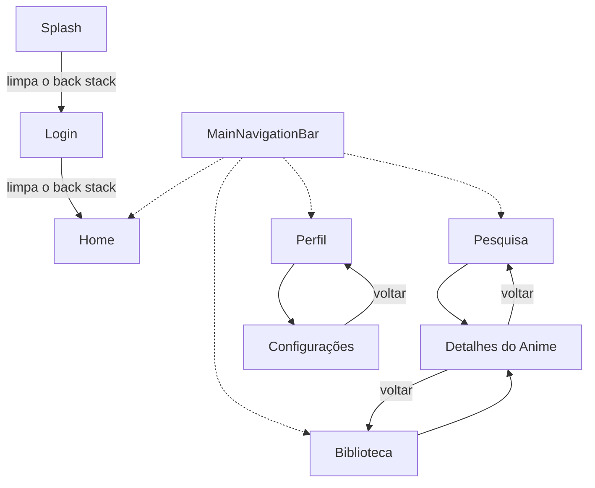
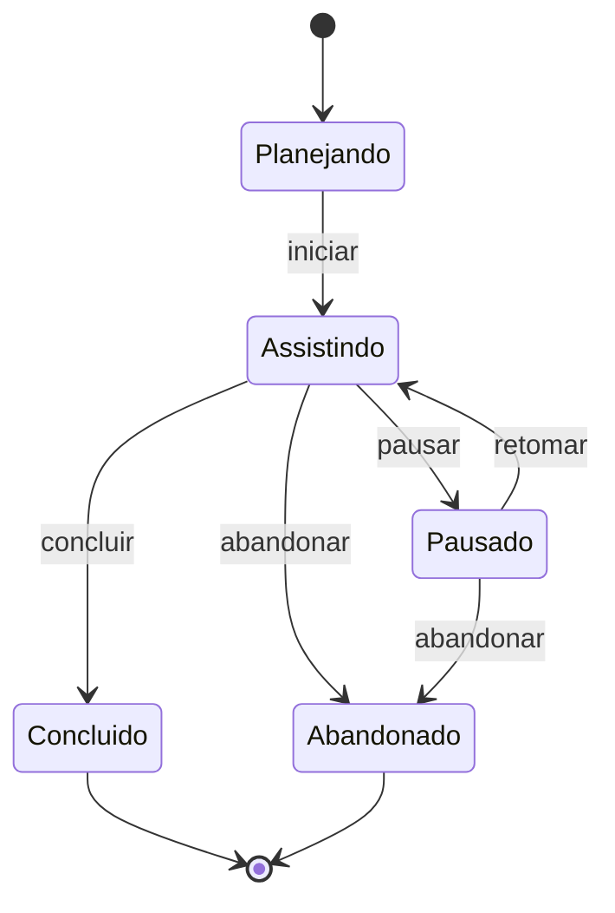
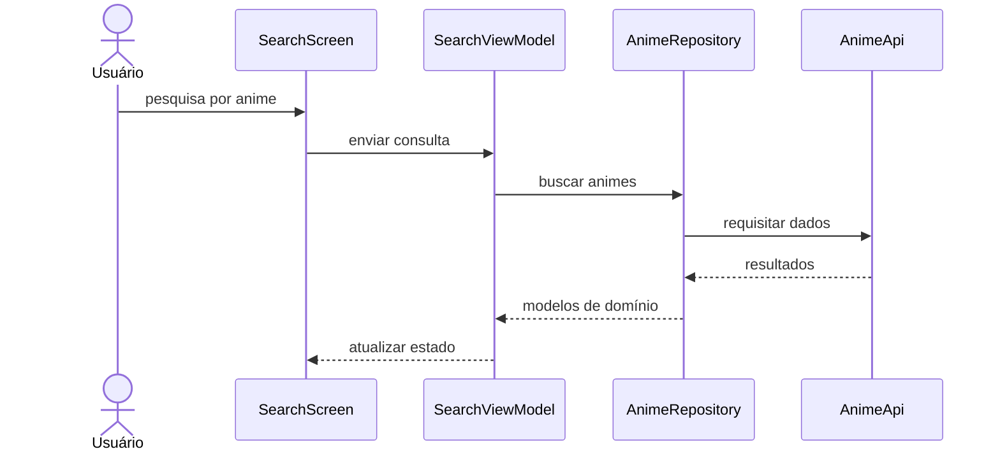
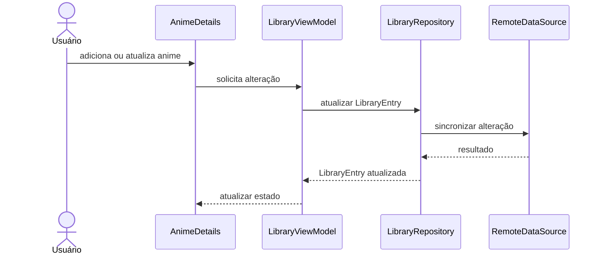
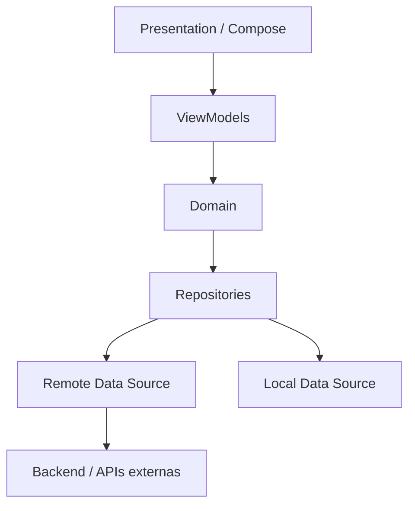

# MykytaDu — Modelagem

> Documento vivo de modelagem do projeto MykytaDu.
>
> Este arquivo concentra os diagramas do sistema utilizando **Mermaid**, acompanhados de explicações sobre decisões de domínio, navegação, arquitetura e fluxos.
>
> O documento deve evoluir junto com as sprints, registrando apenas decisões suficientemente consolidadas para evitar antecipação desnecessária de arquitetura ou regras de negócio.

---

# 1. Objetivo

Este documento tem como objetivo registrar visualmente a evolução estrutural do **MykytaDu**, um aplicativo multiplataforma para controle e acompanhamento de animes.

Os diagramas aqui presentes devem servir como apoio para:

- compreender a estrutura do sistema;
- discutir decisões antes da implementação;
- registrar relações entre entidades;
- documentar fluxos importantes;
- visualizar estados e transições;
- manter alinhamento entre UI, domínio, dados e navegação;
- facilitar a retomada do projeto em novas sessões de desenvolvimento.

A modelagem deve acompanhar a evolução real do código e do roadmap.

---

# 2. Princípios de Modelagem

A documentação do MykytaDu segue os mesmos princípios gerais adotados no desenvolvimento:

- Evolução incremental;
- Evitar antecipação de funcionalidades futuras;
- Uma responsabilidade clara por elemento;
- Baixo acoplamento;
- Reutilização;
- Regras de negócio fora da UI;
- Comunicação externa abstraída por repositories;
- Modelos imutáveis sempre que possível;
- Código e implementação real têm prioridade sobre documentação desatualizada.

Quando houver divergência entre modelagem e implementação, a ordem de prioridade é:

```text
Código atual
    ↓
Implementações e validações recentes
    ↓
Documento Mestre
    ↓
Modelagem
    ↓
Roadmap
    ↓
Documentos históricos
```

Após uma decisão arquitetural relevante ser consolidada no código, este documento deve ser atualizado.

---

# 3. Convenções dos Diagramas

Os diagramas deste documento utilizam **Mermaid**.

## 3.1 Tipos previstos

Ao longo das sprints, poderão ser utilizados:

- `flowchart` — navegação e fluxos;
- `classDiagram` — modelos e relações de domínio;
- `stateDiagram-v2` — estados e transições;
- `sequenceDiagram` — interação entre camadas;
- `erDiagram` — persistência e estrutura de dados, quando necessário.

Diagramas arquiteturais de alto nível podem utilizar `flowchart` quando a representação for mais clara do que uma notação UML tradicional.

## 3.2 Diretrizes

Cada diagrama deve:

1. Ter um objetivo claro;
2. Representar apenas elementos relevantes naquele momento;
3. Possuir uma explicação textual;
4. Diferenciar decisões consolidadas de propostas;
5. Ser atualizado quando a implementação alterar o fluxo representado.

---

# 4. Sprint 3 — Navegação

> **Status:** Concluída.

## 4.1 Objetivo

A Sprint 3 tem como objetivo definir a navegação do aplicativo.

As rotas implementadas são:

- Splash;
- Login;
- Home;
- Pesquisa;
- Detalhes do Anime;
- Biblioteca;
- Perfil;
- Configurações.

Também fazem parte da sprint:

- preparação de rotas protegidas;
- estrutura para Deep Links.

A navegação principal da experiência é formada por:

- Home;
- Biblioteca;
- Pesquisa;
- Perfil.

`Splash`, `Login`, `Detalhes do Anime` e `Configurações` são tratados como destinos auxiliares ou externos à navegação principal.

---

## 4.2 Diagrama de Navegação



---

## 4.3 Interpretação

O fluxo começa pela tela `Splash` e segue para `Login`. Após o avanço, cada uma dessas rotas é removida do back stack:

```text
Splash
  ↓
Login
  ↓
Home
```

Após o acionamento do placeholder de Login, o usuário entra na área principal do aplicativo.

Nesta sprint, o avanço é apenas um gatilho de navegação do placeholder. Não existe autenticação, validação de sessão ou regra de negócio. A infraestrutura apenas classifica as rotas para preparar a Sprint 10.

---

## 4.4 Área Principal

A navegação principal pode ser entendida conceitualmente como:

```text
Área autenticada
├── Home
├── Pesquisa
├── Biblioteca
└── Perfil
```

Esses quatro destinos representam as áreas de uso recorrente do aplicativo.

Eles são centralizados em `MainDestination` e apresentados por `MainNavigationBar`. A troca entre eles substitui a aba atual, evitando acumular todas as abas visitadas no back stack. A barra não é exibida em `Splash`, `Login`, `AnimeDetails` ou `Settings`.

O fluxo conceitual completo fica:

```text
Navegação raiz
├── Splash
├── Login
└── Área autenticada
    ├── Home
    ├── Pesquisa
    │   └── Detalhes do Anime
    ├── Biblioteca
    │   └── Detalhes do Anime
    └── Perfil
        └── Configurações
```

---

## 4.5 Detalhes do Anime

`Detalhes do Anime` é uma rota secundária que pode ser acessada a partir de diferentes pontos da aplicação.

Inicialmente:

```text
Pesquisa
   ↓
Detalhes do Anime
```

e:

```text
Biblioteca
    ↓
Detalhes do Anime
```

No futuro, outras áreas, como a Home, também poderão abrir diretamente os detalhes de um anime.

Essa expansão somente deve ser adicionada ao diagrama quando fizer parte da implementação real.

---

## 4.6 Configurações

A rota `Configurações` está relacionada ao contexto do usuário e é acessada inicialmente através de:

```text
Perfil
  ↓
Configurações
```

Essa organização evita transformar a navegação principal em uma lista excessiva de destinos.

---

## 4.7 Rotas públicas e protegidas

`RouteAccess` consolida a seguinte classificação:

```text
PUBLIC
├── Splash
└── Login

PROTECTED
├── Home
├── Search
├── AnimeDetails
├── Library
├── Profile
└── Settings
```

Essa classificação é somente declarativa. A validação de sessão será implementada na Sprint 10.

---

## 4.8 Deep Links

`AppDeepLink` fornece uma resolução compartilhada para:

```text
mykytadu://app/home
mykytadu://app/search
mykytadu://app/library
mykytadu://app/profile
mykytadu://app/settings
```

Trailing slash é aceito e endereços desconhecidos retornam `null`. `AnimeDetails` não possui Deep Link porque ainda não existe um identificador definitivo de anime. Integrações de entrada específicas para Android e iOS não fazem parte desta sprint.

---

# 5. Sprint 5 — Modelo de Domínio

> **Status:** A definir durante a Sprint 5.

O roadmap prevê os seguintes modelos:

- `Anime`;
- `Genre`;
- `Character`;
- `Studio`;
- `Season`;
- `Episode`;
- `User`;
- `LibraryEntry`;
- `Review`.

Esta seção receberá o **Diagrama de Classes / Modelo de Domínio** quando as relações e responsabilidades forem analisadas.

Estrutura inicial de estudo:

```text
Anime
 ├── Genre
 ├── Character
 ├── Studio
 └── Season
       └── Episode

User
 ├── LibraryEntry
 └── Review
```

> Este esboço não representa ainda uma decisão final de cardinalidade ou composição.

---

## 5.1 Diagrama de Classes

```mermaid
classDiagram
    %% A modelagem será adicionada durante a Sprint 5.
```

---

## 5.2 Questões a validar

Durante a modelagem de domínio deverão ser respondidas questões como:

- Qual é a relação entre `Anime` e `Season`?
- `Episode` pertence diretamente ao `Anime` ou somente a uma `Season`?
- Como gêneros serão representados?
- Um anime pode possuir múltiplos estúdios?
- Quais informações de personagens são necessárias para o frontend?
- O que pertence ao domínio e o que é apenas DTO de API?
- Como representar dados opcionais vindos de APIs externas?
- `Review` é uma entidade independente ou parte da relação entre usuário e anime?

---

# 6. Sprint 5 / Sprint 11 — Estado da Biblioteca

> **Status:** Planejado.

`LibraryEntry` representa conceitualmente a relação do usuário com um anime dentro de sua biblioteca pessoal.

Estados previstos:

- Planejando;
- Assistindo;
- Pausado;
- Concluído;
- Abandonado.

---

## 6.1 Diagrama de Estados de LibraryEntry



> As transições acima representam uma proposta inicial. Regras como reabrir um anime concluído, retomar um abandonado ou concluir automaticamente pelo número de episódios deverão ser decididas durante a modelagem de domínio.

---

# 7. Sprint 6 e Sprint 7 — Fluxos entre Camadas

> **Status:** Planejado.

Quando repositories, data sources e ViewModels estiverem definidos, esta seção documentará os fluxos principais da aplicação.

Arquitetura conceitual esperada:

```text
UI
 ↓
ViewModel
 ↓
Repository
 ├── Remote Data Source
 └── Local Data Source
```

A UI não deverá acessar APIs diretamente.

---

## 7.1 Pesquisa de Anime



> Diagrama conceitual. Nomes finais de métodos, estados e classes serão definidos durante as Sprints 6, 7 e 8.

---

## 7.2 Atualização da Biblioteca



> Diagrama conceitual. A estratégia definitiva de sincronização será definida quando a camada de dados estiver implementada.

---

# 8. Arquitetura de Alto Nível

> **Status:** Conceitual.

A estrutura atual do projeto é organizada em torno de responsabilidades como:

```text
br/com/mykytadu/

├── app/
├── core/
├── data/
├── di/
├── domain/
├── features/
└── presentation/
```

Uma visão simplificada da arquitetura pretendida é:



Essa visão deve ser refinada apenas quando as responsabilidades reais das camadas estiverem consolidadas no código.

---

# 9. ERD / Persistência

> **Status:** Não iniciado.

Um diagrama entidade-relacionamento será criado somente quando houver necessidade concreta de documentar persistência local, backend ou sincronização de dados.

Não devemos assumir que o modelo persistido será idêntico ao modelo de domínio ou aos DTOs das APIs.

```mermaid
erDiagram
    %% Estrutura será definida quando a camada de persistência for modelada.
```

---

# 10. Evolução Prevista por Sprint

| Sprint | Diagrama / Modelagem |
|---|---|
| 3 — Navegação | Diagrama de Navegação |
| 4 — Comunicação | Fluxos HTTP, se necessário |
| 5 — Modelagem | Diagrama de Classes / Domínio |
| 5 / 11 — Biblioteca | Diagrama de Estados |
| 6 — Dados | Sequência entre Repository e Data Sources |
| 7 — Estado | Sequência UI → ViewModel → Repository |
| 8 — Busca | Fluxo completo da pesquisa |
| 9 — Detalhes | Fluxos de carregamento dos detalhes |
| 10 — Autenticação | Fluxo e estados da sessão |
| 11 — Biblioteca | Fluxos de alteração e sincronização |
| 14 — Cache | Estratégia Remote / Local / Cache |
| 15 — Traduções | Fluxo de tradução |
| 16 — Polimento | Revisão geral da documentação |

Essa lista é orientativa e pode mudar de acordo com a evolução real do projeto.

---

# 11. Regras de Manutenção

Ao atualizar este documento:

1. Não adicionar uma arquitetura futura como se já estivesse implementada;
2. Marcar explicitamente diagramas conceituais ou propostas;
3. Atualizar diagramas quando uma decisão mudar;
4. Preferir diagramas pequenos e focados;
5. Evitar duplicar informações já explicadas no Documento Mestre;
6. Registrar principalmente relações, fluxos e decisões que se beneficiem de representação visual;
7. Manter nomes próximos aos utilizados no código;
8. Remover diagramas que tenham deixado de representar o sistema.

---

# 12. Fontes do Projeto

Este documento deve ser mantido em conjunto com:

- [`documento-mestre.md`](documento-mestre.md) — contexto e decisões consolidadas;
- [`identidade-visual.md`](identidade-visual.md) — direção de UX e Design System;
- [`roadmap.md`](roadmap.md) — planejamento das sprints;
- código atual do projeto — fonte definitiva do estado real da implementação.

---

# 13. Estado Atual da Modelagem

## Consolidado

- Sprint 3 concluída e diagrama atualizado para a implementação real;
- oito rotas tipadas e serializáveis;
- fluxo de entrada `Splash → Login → Home` com limpeza do histórico;
- quatro destinos irmãos na navegação principal;
- rotas secundárias e retorno pelo back stack;
- classificação declarativa de acesso;
- estrutura compartilhada e testada para Deep Links.

## Planejado

- Modelo de domínio;
- Cardinalidades entre entidades;
- Estados de `LibraryEntry`;
- Fluxos entre UI, ViewModel, Repository e Data Sources;
- Arquitetura refinada;
- Persistência;
- autenticação e validação real de sessão;
- integração de Deep Links por plataforma, quando necessária;
- Fluxos de cache e tradução.

---

> **Princípio do documento**
>
> Modelar o suficiente para reduzir ambiguidades e orientar a implementação, sem transformar a documentação em uma arquitetura imaginária do futuro.
